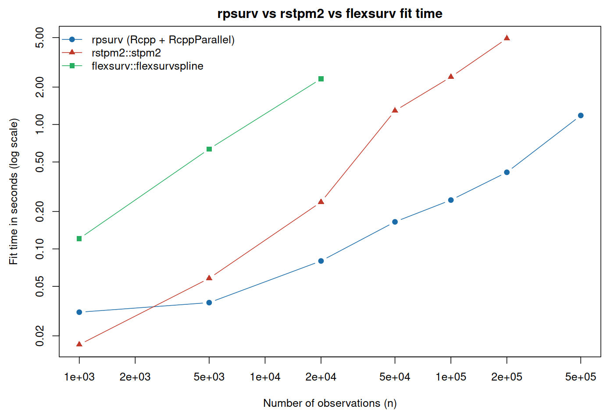

```{r setup, include = FALSE}
knitr::opts_chunk$set(
  collapse = TRUE, comment = "#>", fig.align = "center",
  fig.width = 6, fig.height = 4.2, out.width = "80%"
)
suppressMessages({
  library(survival)
  library(rpsurv)
})
```

# Introduction

`rpsurv` fits the Royston & Parmar (2002) family of flexible parametric
survival models: the baseline distribution is represented by a restricted
cubic spline in $\log t$ on a chosen transformed scale (proportional
hazards, proportional odds, or probit), which lets a smooth, monotone
hazard/survival shape be estimated without committing to a Weibull,
log-normal, or other single parametric family, while still producing a
fully parametric, smooth, extrapolable fit (unlike the Cox model).

`rpsurv` re-implements this model with the log-likelihood and its
analytic gradient evaluated in C++ via `RcppParallel`, so that fitting
scales to hundreds of thousands of rows in about a second (see the Speed
benchmark section). Coefficients, standard errors, and log-likelihoods
are validated against `rstpm2::stpm2` and `flexsurv::flexsurvspline`
(the Validation section).

This vignette covers:

* the spline basis and the likelihood/gradient for all three scales,
* the fitting API and coxph-style output,
* prediction and plotting helpers,
* the distinction between a **time-varying effect** and a **time-varying
  covariate**, and how each is fit,
* residual diagnostics,
* the speed benchmark against `rstpm2`.

# The Royston-Parmar model

## Spline basis

Let $x = \log t$. A restricted (natural) cubic spline with boundary knots
$k_{\min}, k_{\max}$ and interior knots $k_1, \dots, k_m$ is written, in the
Durrleman & Simon / Royston & Parmar parameterisation, as

$$
s(x) = \gamma_0 + \gamma_1 x + \sum_{j=1}^{m} \gamma_{1+j}\, v_j(x),
$$

where the linear term keeps the domain $x \in \mathbb{R}$ and each
nonlinear basis term is

$$
v_j(x) = (x - k_j)_+^3 - \lambda_j (x - k_{\min})_+^3 - (1-\lambda_j)(x - k_{\max})_+^3,
\qquad
\lambda_j = \frac{k_{\max} - k_j}{k_{\max} - k_{\min}},
$$

with $(u)_+ = \max(u, 0)$. This is exactly the basis in `rcs_basis()`
(`R/splines.R`); by construction $s(x)$ is linear beyond the boundary
knots, which keeps extrapolation well-behaved. Its derivative, needed for
the hazard, is

$$
v_j'(x) = 3(x-k_j)_+^2 - 3\lambda_j (x-k_{\min})_+^2 - 3(1-\lambda_j)(x-k_{\max})_+^2 .
$$

Boundary knots default to the min/max of $\log t$ among **events**, and
interior knots to equally spaced centiles of $\log t$ among events
(`default_knots()`), matching `rstpm2`/`flexsurv` defaults.

## Linear predictor and scales

Covariates enter proportionally on the modelled scale:

$$
\eta(t \mid x) = s(\log t) + \beta^\top x .
$$

`rpsurv` supports three transformations $g$ of the survival function,
selected via `scale`:

| `scale`    | $g(S)=\eta$                 | $S(\eta)$              | Interpretation of $\exp(\beta)$ |
|:-----------|:-----------------------------|:------------------------|:---------------------------------|
| `"hazard"` | $\log(-\log S)$              | $\exp(-\exp(\eta))$     | hazard ratio (PH)                |
| `"odds"`   | $\log\{(1-S)/S\}$             | $1/(1+\exp(\eta))$      | odds ratio (PO)                  |
| `"normal"` | $\Phi^{-1}(1-S)$              | $1-\Phi(\eta)$          | probit index                     |

The hazard follows from differentiating $S(t)=S(\eta(t))$ with respect to
$t$ via the chain rule through $x=\log t$:

$$
h(t) = \frac{f(t)}{S(t)} = -\frac{d\eta}{d\log t}\cdot\frac{1}{t}\cdot\frac{S'(\eta)}{S(\eta)} .
$$

Writing $g(\eta) = \log h(t) - \log\!\big(\tfrac{d\eta}{d\log t}\big) + \log t$
(a function of $\eta$ alone, on each scale), the three cases reduce to
closed forms:

$$
g(\eta) = \begin{cases}
\eta & \text{hazard scale} \\
\eta - \log(1+e^{\eta}) & \text{odds scale} \\
\log\phi(\eta) - \log\{1-\Phi(\eta)\} & \text{probit scale}
\end{cases}
$$

so that $\log h(t) = \log\!\big(\tfrac{d\eta}{d\log t}\big) - \log t + g(\eta)$.
This is exactly `scale_terms()` in `src/rpsurv_loglik.cpp`.

## Log-likelihood

For a right-censored observation with event time $t_i$, status $d_i$, and
(for left-truncated / counting-process data) entry time $e_i$, the
contribution is

$$
\ell_i(\beta) = d_i \log h(t_i) + \log S(t_i) - \log S(e_i),
$$

with $\log S(e_i) \equiv 0$ when $e_i = 0$ (no truncation). Summing gives
the full log-likelihood $\ell(\beta) = \sum_i \ell_i(\beta)$, maximised by
`stats::optim(method = "BFGS")` using the analytic gradient below.

## Analytic gradient

Because $\eta$ and $\tfrac{d\eta}{d\log t}$ are both linear in $\beta$
(through the design matrices $X$ and $\dot X = dX/d\log t$), the gradient
of $\ell_i$ with respect to $\beta_k$ is

$$
\frac{\partial \ell_i}{\partial \beta_k} =
d_i\left[\frac{\dot X_{ik}}{\dot\eta_i} + g'(\eta_i) X_{ik}\right]
+ \frac{d\log S}{d\eta}(\eta_i)\, X_{ik}
- \mathbb{1}[e_i>0]\,\frac{d\log S}{d\eta}(\eta_{e_i})\, X^{(e)}_{ik},
$$

where $X^{(e)}$ is the design row evaluated at $\log e_i$. The scale-specific
pieces $g'(\eta)$ and $d\log S/d\eta$ are, again, closed form (hazard:
$g'=1$, $d\log S/d\eta = -e^\eta$; odds: $g'=S$, $d\log S/d\eta=-(1-S)$;
probit: $g'=-\eta+\phi(\eta)/S$, $d\log S/d\eta=-\phi(\eta)/S$). Evaluating
$\ell$ and $\nabla\ell$ this way — rather than by finite differences —
avoids the $O(p)$ extra likelihood evaluations per optimiser step that a
numerical gradient would cost, which is the main source of `rpsurv`'s speed
advantage together with parallel evaluation across observations
(`RcppParallel::parallelReduce`, `src/rpsurv_loglik.cpp`).

An observation with $d_i=1$ and $\dot\eta_i \le 0$ (a locally decreasing,
i.e. invalid, hazard) is given a large penalty rather than `NaN`, likewise
any row where $S(e_i) < S(t_i)$ (non-monotone survival across a
truncation interval) — both keep the optimiser inside the region where the
model is a valid survival distribution.

# Fitting API and output

```{r fit-basic}
data(brcancer, package = "rstpm2")
brcancer$hormon <- as.numeric(brcancer$hormon)

fit <- rpsurv(Surv(rectime, censrec) ~ hormon, data = brcancer, df = 4, scale = "hazard")
summary(fit)
```

The summary separates interpretable covariate effects (with hazard/odds
ratios and Wald tests) from the baseline spline coefficients, which are
nuisance parameters describing the shape of $h_0(t)$ and are not
individually interpretable.

# Prediction and plots

`predict()` returns survival, cumulative hazard, hazard, or the linear
predictor, optionally with delta-method confidence limits; `plot()` wraps
it for quick visualisation.

```{r predict-plot, fig.cap = "Predicted survival by hormonal therapy status."}
plot(fit, newdata = data.frame(hormon = c(0, 1)), col = c("steelblue", "firebrick"),
     main = "rpsurv: predicted survival")
```

# Time-varying effect vs. time-varying covariate

These are two different extensions of the base model, and `rpsurv`
supports both — separately or together.

## Time-varying effect (non-proportional hazards)

A covariate's *value* is fixed for a subject, but its *coefficient*
$\beta(t)$ is allowed to change over follow-up: instead of $\beta x$, the
linear predictor gets $x \cdot s_{\text{tve}}(\log t)$, i.e. its own spline
in log time multiplying the covariate. Request this with `tve`:

```{r tve-fit}
fit_tve <- rpsurv(Surv(rectime, censrec) ~ hormon, data = brcancer,
                   df = 4, tve = "hormon", tve.df = 2)
coef(fit_tve)
```

The `hormon:s(logt)*` coefficients trace out how the hormonal-therapy
hazard ratio evolves with time; a likelihood-ratio test against `fit`
(both fitted by maximum likelihood, nested models) tests proportionality:

```{r tve-lrt}
lrt_stat <- 2 * (fit_tve$loglik - fit$loglik)
lrt_df <- fit_tve$df - fit$df
pchisq(lrt_stat, lrt_df, lower.tail = FALSE)
```

## Time-varying covariate

Here the covariate's *value itself* changes during follow-up (e.g. a
biomarker updated at clinic visits). This has nothing to do with `tve`;
it is a data-representation question. Split each subject's follow-up into
consecutive intervals over which the covariate is constant, and supply
counting-process data via `Surv(start, stop, status)`:

```{r tvc-example}
d <- brcancer
d$id <- seq_len(nrow(d))
half <- d$rectime / 2
first  <- data.frame(id = d$id, start = 0, stop = half, status = 0,
                      hormon = d$hormon, x1 = d$x1)
second <- data.frame(id = d$id, start = half, stop = d$rectime, status = d$censrec,
                      hormon = d$hormon, x1 = d$x1 + 1)  # covariate value changes
long <- rbind(first, second)
long <- long[long$start < long$stop, ]

fit_cp <- rpsurv(Surv(start, stop, status) ~ hormon + x1, data = long, df = 4)
fit_cp$counting
coef(fit_cp)
```

`rpsurv` detects the 3-column `Surv` object and fits the left-truncated
likelihood of Section 2 automatically —
each interval contributes $\log S(\text{stop}) - \log S(\text{start})$,
correctly accounting for the subject having already survived to
`start` under the covariate value(s) of the *previous* interval. The same
mechanism (`Surv(start, stop, status)`) also handles ordinary left
truncation (delayed entry) when the covariate values do not change.

# Diagnostics

```{r diagnostics, fig.cap = "Cox-Snell residual check: points should lie near the diagonal."}
coxsnell_plot(fit)
```

```{r deviance-resid}
dev_resid <- residuals(fit, type = "deviance")
summary(dev_resid)
```

`km_compare_plot()` overlays the model-implied survival curve on the
nonparametric Kaplan-Meier estimate, by strata of a covariate — a direct
visual check of whether the chosen spline `df` and `scale` capture the
data:

```{r km-compare, fig.cap = "Model vs. Kaplan-Meier, by hormonal therapy status."}
km_compare_plot(fit, by = "hormon")
```

# Validation against rstpm2 and flexsurv {#validation}

```{r validation, eval = requireNamespace("rstpm2", quietly = TRUE)}
suppressPackageStartupMessages(library(rstpm2))
ref <- stpm2(Surv(rectime, censrec) ~ hormon, data = brcancer, df = 4)
data.frame(
  term = c("hormon", "logLik"),
  rpsurv = c(coef(fit)["hormon"], fit$loglik),
  stpm2  = c(coef(ref)["hormon"], -ref@min)
)
```

Coefficients, standard errors, and log-likelihoods agree with `rstpm2` to
4-5 decimal places across all three scales (`hazard`, `odds`, `normal`)
and with `flexsurv::flexsurvspline` on the hazard scale; see
`tests/testthat/test-rpsurv.R` for the full parity suite, which also
covers left truncation.

# Speed benchmark {#speed}

The likelihood and gradient are evaluated once per optimiser iteration in
parallel C++ rather than by repeated R-level evaluation (as a numerical
gradient would require), so `rpsurv` scales roughly linearly in $n$ with a
small constant. The figure below compares wall-clock fit time against
`rstpm2::stpm2` on simulated Weibull-hazard data with two covariates
(reproducible via `data-raw/benchmark.R`, shipped with the package
source):

```{r benchmark-table, echo = FALSE}
res <- readRDS(system.file("extdata", "benchmark_results.rds", package = "rpsurv"))
knitr::kable(res, digits = 3, col.names = c("n", "rpsurv (s)", "stpm2 (s)"))
```

```{r benchmark-fig, echo = FALSE, out.width = "90%", fig.cap = "Fit time vs. sample size (log-log axes)."}

```

At $n=2\times10^5$, `rpsurv` is about `r round(res$rstpm2[res$n == 2e5] / res$rpsurv[res$n == 2e5], 1)`x
faster than `rstpm2::stpm2`, and continues to scale to $n=5\times10^5$
(`rstpm2` was not run at that size). The benchmark code itself:

```{r benchmark-code, eval = FALSE}
simulate_data <- function(n, seed = 1) {
  set.seed(seed)
  x1 <- rnorm(n); x2 <- rbinom(n, 1, 0.5)
  lp <- 0.5 * x1 - 0.3 * x2
  u <- runif(n)
  event_time <- (-log(u) / (0.01 * exp(lp)))^(1 / 1.2)
  cens_time <- rexp(n, 0.008)
  data.frame(time = pmin(event_time, cens_time),
             status = as.numeric(event_time <= cens_time), x1 = x1, x2 = x2)
}
d <- simulate_data(200000)
system.time(rpsurv(Surv(time, status) ~ x1 + x2, data = d, df = 4))
system.time(stpm2(Surv(time, status) ~ x1 + x2, data = d, df = 4))
```

# Session info

```{r session-info}
sessionInfo()
```
